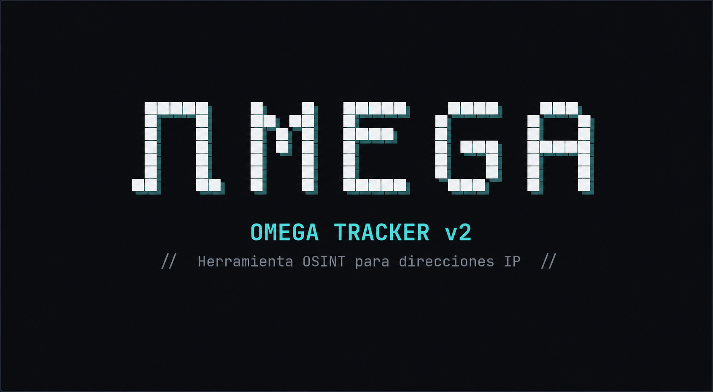
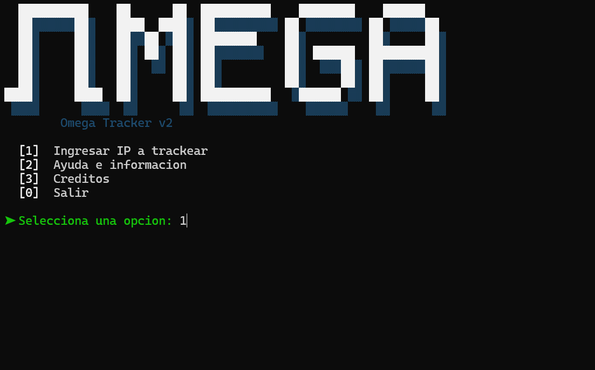
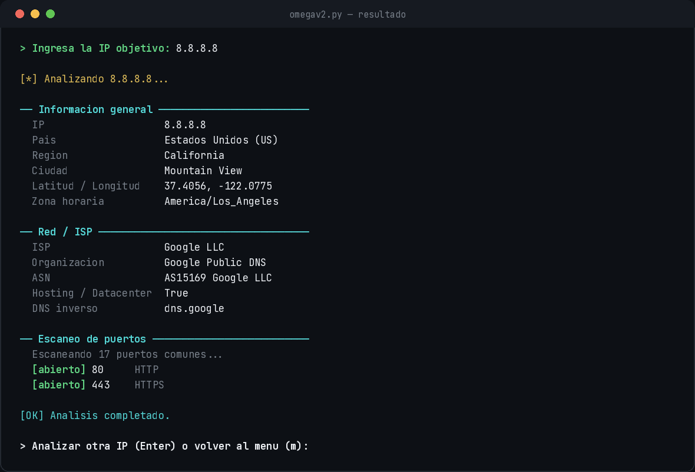

<div align="center">



### 🛰️ Herramienta OSINT para reconocimiento de direcciones IP


</div>

## 📖 Descripción

**Omega Tracker v2** es la sucesora de [Omega Tracker](https://github.com/Spyk3r/Omega-Tracker), la herramienta original que permitía obtener información básica de una dirección IP. Esta nueva versión fue reescrita completamente desde cero 🔧, con un motor de reconocimiento mucho más completo, un menú interactivo y una interfaz de terminal con animación propia.

Todo el escaneo se realiza con la librería estándar de Python, así que funciona igual en Windows, Linux y macOS sin instalar nada adicional. 🐍

> ⚠️ \*\*Uso responsable:\*\* esta herramienta usa únicamente APIs públicas y técnicas no intrusivas (sin explotación de vulnerabilidades). 


## ✨ Características

|||
|-|-|
|🌍|Geolocalización aproximada (país, región, ciudad, lat/lon, zona horaria)|
|🏢|Datos de ISP, organización y ASN|
|🕵️|Detección de proxy / VPN / hosting|
|🔁|DNS inverso|
|📇|WHOIS / RDAP con contactos de abuso|
|🔓|Escaneo de \~17 puertos comunes (TCP connect scan, sin dependencias externas)|
|🔐|Lectura de certificado TLS si el puerto 443 está abierto|
|📡|Cabeceras HTTP si el puerto 80/443 está abierto|
|🎛️|Menú interactivo con opción de encadenar varias búsquedas|
|🎨|Banner ASCII animado con efecto glitch al iniciar|


## 🖼️ Capturas

<div align="center">

**Menú principal**



**Resultado de un análisis**



</div>


## ⚙️ Instalación

```bash
git clone https://github.com/Spyk3r/Omega-Tracker-V2.git
cd Omega-Tracker-V2
pip install -r requirements.txt
```

### Requisitos

* 🐍 Python 3.9 o superior
* 📦 Las dependencias listadas en `requirements.txt`:

  * `requests`
  * `ipwhois`
  * `cryptography`


## 🚀 Uso

```bash
python3 omegav2.py
```

En Windows:

```bash
python omegav2.py
```

Al iniciar verás la animación del banner y luego el menú principal:

|Opción|Acción|
|:-:|-|
|`1`|🎯 Ingresar una IP para trackear|
|`2`|❓ Ver ayuda e información de la herramienta|
|`3`|👤 Ver créditos|
|`0`|🚪 Salir|

Después de analizar una IP, puedes presionar **Enter** para analizar otra inmediatamente, o escribir **`m`** para volver al menú principal. 🔄


## 🧠 Información que recolecta

<details>
<summary><strong>🌍 Información general</strong></summary>

* País, región, ciudad, código postal
* Latitud / longitud aproximadas
* Zona horaria

</details>

<details>
<summary><strong>🏢 Red / ISP</strong></summary>

* ISP, organización, ASN y nombre de ASN
* Detección de hosting/datacenter y de proxy/VPN
* DNS inverso

</details>

<details>
<summary><strong>📇 WHOIS / RDAP</strong></summary>

* Rango CIDR y nombre de la red
* Descripción del ASN
* Contactos de abuso (abuse emails)

</details>

<details>
<summary><strong>🔓 Puertos</strong></summary>

* Escaneo TCP connect sobre \~17 puertos comunes (SSH, HTTP, HTTPS, RDP, bases de datos, etc.)

</details>

<details>
<summary><strong>🔐 TLS / HTTP</strong></summary>

* Emisor, sujeto y expiración del certificado TLS (si el 443 está abierto)
* Cabeceras HTTP como `Server`, `X-Powered-By`, `Via` (si el 80/443 está abierto)

</details>


## 🧪 Testeado en

* ✅ Windows 10 / 11 (Windows Terminal / PowerShell)
* ✅ Kali Linux
* ✅ Termux (Android)
* ✅ macOS


## 👤 Créditos

|||
|-|-|
|🧑‍💻 **Creador**|Spyk3r|
|🐙 **GitHub**|[github.com/Spyk3r](https://github.com/Spyk3r)|
|💬 **Discord**|spyk3r|


<div align="center">

Hecho con 🖤 por **Spyk3r**

</div>

